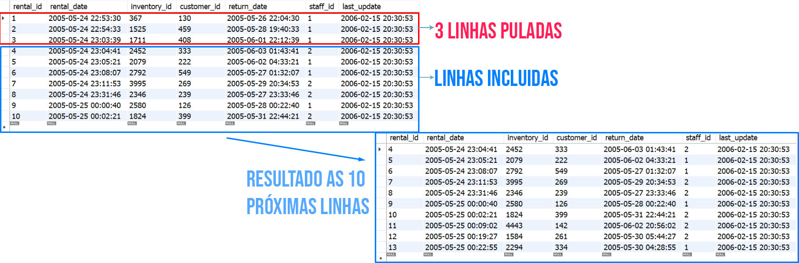

## LIMIT OFFSET - Pulando linhas desnecessárias
Para pular uma certa quantidade de linhas do seu resultado, você pode usar o comando OFFSET .

```bash
  # Query + LIMIT quantidade_de_linhas OFFSET quantidade_de_linhas
  SELECT * FROM sakila.rental LIMIT 10 OFFSET 3;
```

<p>
  
</p>

Você poderia também limitar os resultados de forma gráfica, usando as opções do Workbench , que, por padrão, não impõe limites aos resultados de suas pesquisas.
<p>
  
</p>

Ótimo, tomara que tenha conseguido achar o resultado do último desafio. Você está quase lá! Vamos fechar este dia de aprendizado descobrindo como gerar resultados do tipo que todo chefe gosta de ter: "Tudo bem organizado", usando o ORDER BY .
<p>
  
</p>

Ordenando pelo id
```bash
SELECT * FROM sakila.actor ORDER BY actor_id LIMIT 10 OFFSET 5;
```
