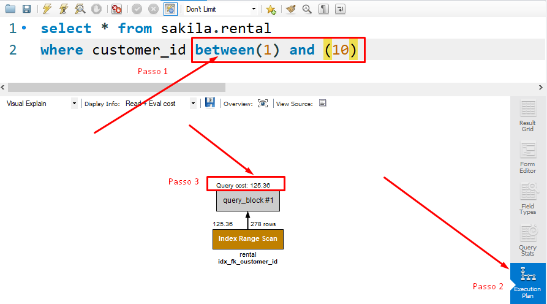

## Englobando uma faixa de resultados com IN e BETWEEN

Operador IN
Como você viu no início do dia hoje, é possível juntar várias condições nas suas queries usando os operadores AND e OR . No entanto, você ainda terá que digitar cada condição separadamente, como no exemplo a seguir:

```bash
  SELECT * FROM sakila.actor
  WHERE first_name = 'PENELOPE'
  OR first_name = 'NICK'
  OR first_name = 'ED'
  OR first_name = 'JENNIFER';
```

Uma forma melhor de fazer essa mesma pesquisa seria usando o IN :

```bash
  SELECT * FROM sakila.actor
  WHERE first_name IN ('PENELOPE','NICK','ED','JENNIFER');
```
<p>

</p>

Você poderia fazer esse mesmo processo para números também:
```bash
  SELECT * FROM sakila.customer
  WHERE customer_id in (1, 2, 3, 4, 5);
```
  <p>
  
  </p>

  Então, para que você faça pesquisas utilizando o IN , a sintaxe que deve ser usada é a seguinte:

  ```bash
    SELECT * FROM banco_de_dados
    WHERE coluna IN (valor1, valor2, valor3, valor4, ..., valorN);

  -- ou também
    SELECT * FROM banco_de_dados
    WHERE coluna IN (expressão);
  ```

- Como você faria, então, para encontrar, usando o IN , todos os detalhes sobre o aluguel dos clientes com os seguintes ids: 269, 239, 126, 399, 142? As informações podem ser encontradas na tabela payment .
- Como encontraria todas as informações sobre os endereços que estão registrados nos distritos de QLD, Nagasaki, California, Attika, Mandalay, Nantou e Texas? As informações podem ser encontradas na tabela address.

### Operador BETWEEN
Uma outra opção quando queremos trabalhar com faixas de resultados é o BETWEEN , que torna possível fazer pesquisas dentro de uma faixa inicial e final.

```
  expressão BETWEEN valor1 AND valor2;
  -- a expressão é a sua query
  -- e valor1 e valor2 delimitam o resultado
```

Então, quando você faz uma query como essa, você terá o resultado da imagem a seguir:

```bash
-- Note que o MySQL inclui o valor inicial e o final nos resultados
  SELECT title, length FROM sakila.film
  WHERE length BETWEEN 50 AND 120;
```

<p>

</p>

### Usando o BETWEEN com strings

Para encontrar uma faixa de valores em que os valores são strings, podemos digitar a palavra por completo para encontrar os valores. Exemplo:

```bash
  SELECT * FROM sakila.language
  WHERE name BETWEEN 'Italian' AND 'Mandarin'
  ORDER BY name;
```

### Usando o BETWEEN com datas

Para usar o BETWEEN com datas, basta que você digite o valor no formato padrão da data, que é YYYY-MM-DD HH:MM:SS , sendo os valores de horas, minutos e segundos opcionais. No exemplo abaixo, estamos filtrando os resultados para exibir o rental_id e rental_date apenas entre o mês 05 e o mês 07:

```bash
  SELECT rental_id, rental_date FROM sakila.rental
  WHERE rental_date
  BETWEEN '2005-05-27' AND '2005-07-17';
```

<p>

</p>

### Como decidir qual usar?

Lembre-se de que, no caso do IN , você precisa especificar os valores que devem ser incluídos no resultado e, no caso do BETWEEN , você não precisa incluir os valores que estão entre o valor inicial e final. Então, vale a pena analisar essa diferença e ver qual te atenderá melhor.

### Qual tem a melhor performance?

A melhor forma de responder a essa pergunta é: depende .
Não é o que você esperava? Então vai aqui uma resposta melhor: isso vai depender do tipo e quantidade de dados com os quais você está trabalhando. A melhor forma de você não chutar é clicar no botão Execution Plan no MySQL Workbench e verificar o tempo de execução para tomar a decisão de qual tem o menor custo de execução - o que significa que a query finalizará mais rápido.
Há outras ferramentas inteiras só para mensurar performance. Considere o Execution Plan apenas uma introdução ao tema.
Fazendo um pequeno teste, temos os seguintes resultados (que podem sofrer alterações, dependendo da quantidade de dados com os quais se está trabalhando):

<p>

</p>

<p>

</p>

No final das contas, depois de analisar questões como performance, você poderá tomar sua decisão sobre qual usar com mais segurança!

## Para Fixar

- Mostre o nome, sobrenome e e-mail dos clientes com os seguintes sobrenomes: hicks, crawford, henry, boyd, mason, morales e kennedy , ordenados por nome em ordem alfabética.
```bash
  SELECT * FROM sakila.actor
  WHERE first_name IN('PENELOPE','NICK','ED','JENNIFER') ORDER BY first_name ASC;
```

- Mostre o e-mail dos clientes com os address_id 172, 173, 174, 175 e 176 , ordenados em ordem alfabética.
```bash
  SELECT email FROM sakila.customer
  WHERE address_id IN(172, 173, 174, 175, 176) ORDER BY email ASC;
  or

  SELECT email FROM sakila.customer
  WHERE address_id BETWEEN 172 AND 176
  ORDER BY email;
```

- Descubra quantos pagamentos foram feitos entre 01/05/2005 e 01/08/2005 . Lembre-se de que, no banco de dados, as datas estão 
armazenadas no formato ano/mês/dia , diferente do formato brasileiro, que é dia/mês/ano .
```bash
  SELECT COUNT(*) as quantidade_pagamento FROM sakila.payment
  WHERE DATE(payment_date) BETWEEN '2005-05-01' AND '2005-08-01';
```

- Mostre o título, ano de lançamento e duração do empréstimo de todos os filmes com a duração de empréstimo de 3 a 6 . Os resultados devem ser classificados em filmes com maior duração de empréstimo primeiro. Em caso de empate, ordene em ordem alfabética pelo título.
```bash
  SELECT title, release_year, rental_duration FROM sakila.film
  WHERE rental_duration BETWEEN 3 AND 6 ORDER BY rental_duration DESC, title;
```

- Monte um relatório que exiba o título e classificação dos 500 primeiros filmes direcionados para as classificações indicativas G, PG e PG-13 . Os resultados devem estar ordenados por título.
```bash
  SELECT title, rating FROM sakila.film
  WHERE rating IN('G', 'PG', 'PG-13') ORDER BY title LIMIT 500;
```

P.S. As classificações podem ser verificadas acima, na seção "Alavancando o poder dos principais comparadores lógicos".