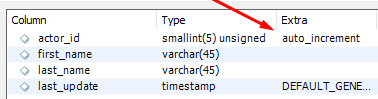
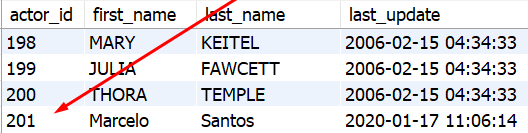
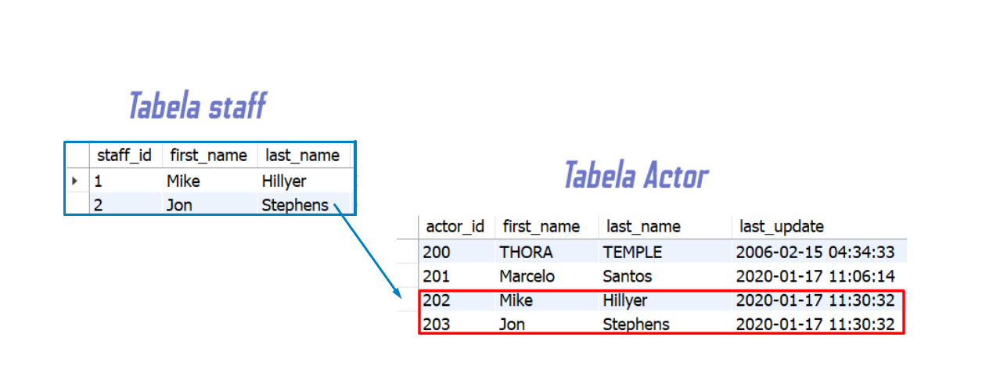

## Tabela vazia ? Vamos resolver isso ae! INSERT na prática
Informação importante sobre os tipos de aspas
Backticks ou crase ( `` ) : São usadas para identificar nome de tabelas e colunas . São necessárias apenas quando o identificador for uma palavra reservada do MySQL , ou quando o nome da tabela ou coluna contiver espaços em branco.
Aspas simples ( '' ) : Devem ser usadas em valores do tipo string . Aspas simples são aceitas na maioria dos sistemas de gerenciamento de banco de dados. Sendo assim, é preferível usar aspas simples no lugar das aspas duplas.
Só usaremos os backticks aqui nos exemplos caso sejam absolutamente necessários. Caso contrário, eles serão omitidos.
Vamos começar a dar vida ao banco sakila . Uma pesquisa rápida na tabela sakila.staff nos informa de que a empresa possui apenas dois funcionários. Acho que ela pode contar com nossa ajuda para melhorar isso. A sintaxe para inserir dados em uma tabela é a seguinte:

```bash
  INSERT INTO nome_da_tabela (coluna1, coluna2)
  VALUES ('valor_coluna1', 'valor_coluna2');
```
Isso vai inserir uma linha na tabela nome_da_tabela os valores em suas colunas correspondentes. Apesar de ser possível inserir novos valores sem especificar os nomes das colunas, é uma boa prática sempre especificá-los porque:
- Caso a estrutura da tabela tenha mudado enquanto se escreve a query , você será alertado.
- Melhora a compreensão para quem estiver lendo sua query futuramente.

### Inserindo várias linhas de uma vez
É possível inserir múltiplas linhas em uma tabela com uma única query :
```bash
  INSERT INTO nome_da_tabela (coluna1, coluna2) VALUES
  ('valor_1','valor_2'),
  ('valor_3','valor_4'),
  ('valor_5','valor_6');
```
Dessa maneira, podemos ganhar muito tempo, tanto em tecladas como em performance de inserção. Em média, 100 linhas inseridas dessa maneira podem ser até 10 vezes mais rápidas que fazendo inserções de forma individual.

### Ignorando linhas existentes

Quando for importar uma quantidade grande de dados, pode ser preferível, em alguns cenários, que você simplesmente ignore os erros e pule os dados problemáticos, que normalmente interromperiam a query em função de alguma restrição imposta na tabela. Ex: duplicidade de primary keys . Podemos ignorar os erros durante a inserção usando o INSERT IGNORE .
Considere a tabela e a query a seguir:
<p>
  
</p>

```
  INSERT IGNORE INTO pessoas (id, name) VALUES
  (4,'Gloria'), -- Sem o IGNORE, essa linha geraria um erro e o INSERT não continuaria.
  (5,'Amanda');

  -- Pesquisando agora, você verá que a informação duplicada não foi inserida.
  -- Porém os dados corretos foram inseridos com sucesso.
  SELECT * FROM pessoas;
```
<p>
  
</p>
O importante aqui é lembrar que o INSERT IGNORE vai pular os outros erros silenciosamente também.

### Inserindo valores em colunas com auto_increment

Primeiramente, é preciso saber que o auto_increment é uma funcionalidade que todos os bancos de dados possuem. Ela permite que valores sejam gerados automaticamente cada vez que uma nova linha é inserida em uma tabela que tem essa restrição ativa. Ao inserir um novo ator na tabela sakila.actor , caso outros atores ainda não tenham sido inseridos desde que o banco foi restaurado, o próximo valor que será gerado para actor_id será o valor do último id registrado acrescido de um (201 + 1).
<p>
  
</p>


Com isso em mente, a coluna que possui auto_increment é omitida no INSERT , uma vez que o valor já é gerado automaticamente:

```bash
  INSERT INTO sakila.actor (first_name, last_name)
  VALUES('Marcelo','Santos');
```
<p>
  
</p>

## INSERT SELECT (Inserindo dados de uma outra tabela)
É possível inserir dados a partir de outra tabela usando INSERT INTO SELECT :

```bash
  INSERT INTO tabelaA (coluna1, coluna2)
      SELECT tabelaB.coluna1, tabelaB.coluna2
      FROM tabelaB
      WHERE tabelaB.nome_da_coluna <> 'algumValor'
      ORDER BY tabelaB.coluna_de_ordenacao;
```

Assim, estaríamos extraindo a coluna1 e a coluna2 da tabelaB e as inserindo na tabelaA , de acordo com a condição que for passada no WHERE .
É possível usar também SELECT * FROM e copiar todos os dados de todas as colunas de uma tabela para outra, mas nessa situação a tabelaA e a tabelaB precisam obrigatoriamente possuir a mesma quantidade de colunas, e os tipos de dados das colunas correspondentes devem ser iguais.
Com essa funcionalidade, é fácil criar tabelas temporárias para testes ou por necessidade. Por exemplo, para trazer os dados da tabela sakila.staff para a tabela sakila.actor , poderíamos fazer:

```bash
  INSERT INTO sakila.actor (first_name, last_name)
      SELECT first_name, last_name FROM sakila.staff;
```

<p>
  
</p>

Um grande filósofo uma vez disse: "Practice Makes Perfect" . Não sabemos quem ele é, mas ele tem razão! Vamos praticar!

- Insira um novo funcionário na tabela sakila.staff .
```bash
  INSERT INTO `sakila`.`staff`
      (first_name, last_name, address_id, email, store_id, active, username, password)
  VALUES
      ('Geralt', 'of Rivia', 2, 'tossacoin@gmail.com', 1, 1, 'geralt', 'theWhiteWolf');
```
- Para saber quais campos são obrigatórios, clique com o botão direito na tabela sakila.staff e selecione "Table Inspector". 
Clique na aba "columns" e verifique quais campos aceitam nulos para te guiar. Lembre-se de que valores que são gerados automaticamente não precisam ser inseridos manualmente. Boa explorada!
```bash
  INSERT INTO sakila.staff
      (first_name, last_name, address_id, email, store_id, active, username, password)
  VALUES
      ('Jeff', 'Bezos', 2, 'jeffbezos@gmail.com', 1, 1, 'jeffb', 'ImTheChamp'),
      ('Sekiro', 'Okami', 2, 'sekirowolf@gmail.com', 1, 1, 'okami', 'SekiroTheSamurai');
```
- Feito o exercício anterior, vamos agora para o nível 2. Insira dois funcionários novos em apenas uma query .
Selecione os cinco primeiros nomes e sobrenomes da tabela sakila.customer e cadastre essas pessoas como atores na tabela sakila.actor .
```bash
  INSERT INTO sakila.actor(first_name, last_name)
    SELECT first_name, last_name
    FROM sakila.customer
    ORDER BY customer_id
    LIMIT 5;
```
- Cadastre três categorias de uma vez só na tabela sakila.category .
```bash
    INSERT INTO sakila.category (name)
  VALUES
      ('Sci-Fi'),
      ('Fantasy'),
      ('Biography');
```
- Cadastre uma nova loja na tabela sakila.store .
```bash
  INSERT INTO sakila.store (manager_staff_id, address_id)
  VALUES (3, 3);
```